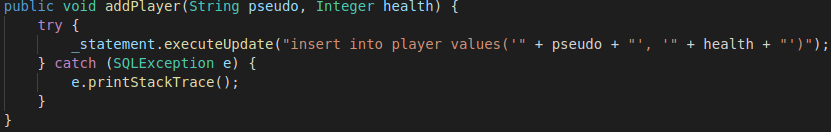

# Workshop_Sqlite
A workshop to learn how to create a native sqlite database in Java

# Partie 1 : introduction
Bienvenu dans ce workshop sur le package natif sql de java. En effet ce package a l'avantage d'être "natif" ce qui veux dire qu'il ne nécessite aucune installation supplémentaire pour être utilisé, il suffit de l'importer dans votre code come ceci.
 ```
 import java.sql.*;
 ```
 
 # Partie 2 : explication architecture, création table, insertion
 
 Dans la partie suivante nous allons couvrir :
 + La base des query SQL (création d'une table, ajout et retrait d'un élement d'une table)
 + Qu'est-ce qu'un singleton et un Builder et quel sont leurs intérêts

## La base des queries SQL
Le langage SQL fonctionne différement des langages impératifs que vous avez l'habitude de manipuler. Ici on manipule le code a l'aide de "queries" qui permettent de demander a notre base de donnée d'effectuer un ordre que l'on spécifie.


Tout d'abord commencons par créer une table, on vérifie qu'elle n'existe pas déjà avec "if not exist" et nous lui donnont 2 colonnes, pseudo et health.\
En SQL il nous faut donc créer des tables avec des colonnes définies à la création pour stocker nos données, les données dans une table sont appelée des lignes.\
Idéalement, on préfére un petit nombre de tables pour un grand nombres de lignes, il vaux mieux éviter les tables avec des colonnes trop spécifiques qui n'acceuillerons que peu de lignes.\
Pour les besoin du test, on peux aussi rajouter une ligne avec la query "drop table if exist player" avant la création pour réinitialiser la table à chaque lancement de notre programme.



Maintenant que notre table existe, il faut ajouter une ligne dedans a l'aide de "insert". Ceci n'est pas la seule synthaxe existante mais ici nous utiliserons celle-ci.


Et pour finir, il nous faut évidement de quoi retirer une ligne de notre table et pour cela nous allons utiliser "delete" combiné à "where" qui nous sert a trier la donnée demandée par la query.

## Qu'est-ce qu'un singleton et un builder

Avant de vous laisser sur la partie d'exercice pratique un rapide point sur les design paterns qui sont utilisé dans ce workshop.\
Les design patern sont des formats de classe récurrent qui servent à simplifier la compréhension du code quand ce dernier passe entre plusieurs développeur. Il est donc de bonne pratique de les utiliser le plus souvent possible et d'en connaitre l'existence.


Dans cette image on peux voir un exemple de singleton, le singleton est un type de design patern qui sert à faire en sorte qu'une classe ne puisse être créée qu'une seule fois en mettant en place 3 choses très précises.
+ L'instance unique de cette classe diréctement à l'intérieur d'elle même et en privé.
+ Son propre constructeur en privé.
+ Une méthode publique afin d'obtenir une référence de l'instance de la classe.

Une fois tout ceci mis en place, votre classe est maintenant un singleton et il ne pourras en exister qu'une seule instance, qui est créée au lancement du programme.

Et enfin le builder, ce design patern peux paraitre inutile au premier abord car il ne sert pas à quelque chose de "fonctionnel" comme le singleton, il est la pour éviter les erreurs lors de la programmation et augmenter la lisibilitée du code.\
Le builder s'impose lorsqu'une classe commence à demander un grand nombres d'arguments lors de sa création et il deviens facile de faire une erreur quand on rentre ces dernières.


Un builder se consitute de variables en private, de setter pour chaque variable et d'une méthode build pour finaliser la construction.

Pour la classe Player un build ressembleras donc a la ligne suivante
```
_builder.setPseudo(pseudo).setHealth(health).build();
```
On peux donc voir qu'au lieu de passer diréctement les valeurs au constructeur de la classe, on les donne au setters du builder ce qui rend la construction bien plus lisible et évite les erreurs de valeur mise dans le mauvais ordre par inadvertance.

# Partie 3 : Exercice pratique

Maintenant je vais vous laisser sur un exercice pratique.

+ Tout d'abord vous devrez arranger la méthode get() pour qu'elle nous construise un Player à l'aide des données récupérée depuis la database.
+ Ensuite vous devrez rendre la classe compatible à un usage concurentiel, ce qui veux dire mutexer l'ensemble des fonctions pour éviter des soucis lorsque la classe est utilisée par plusieurs threads a la fois. Je vous ais déjà mis à disposition un mutex dans la classe Dao dont PlayerDao hérite, contentez vous donc d'utiliser la variable "_mutex".
+ Et pour finir vous devrez ajouter une nouvelle table à la database, la table spell, et, en utilisant la classe déjà présente, ajouter une liste de spell au player que vous lui ajouterez lors de sa création dans la méthode get().

Merci pour votre participation a ce workshop et bonne travail !
 
